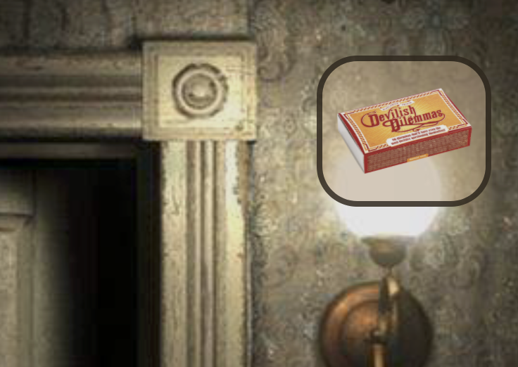
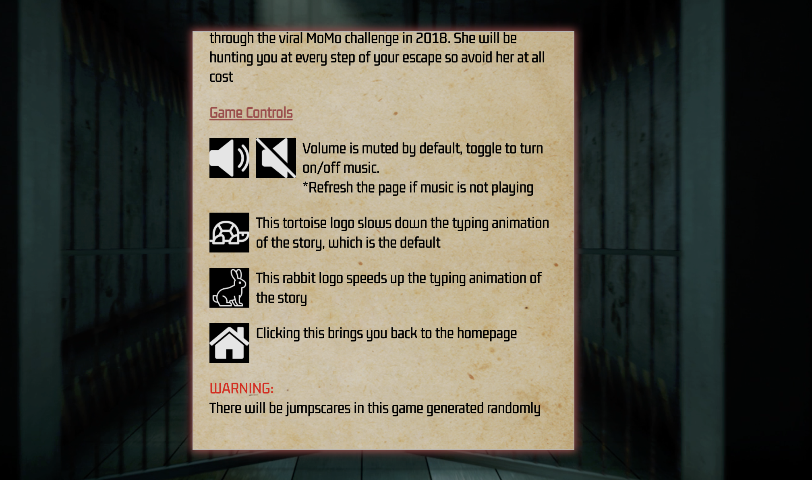
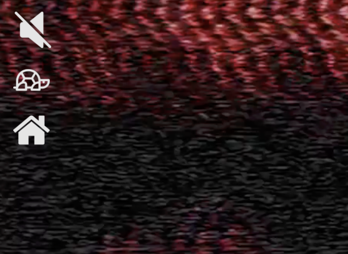
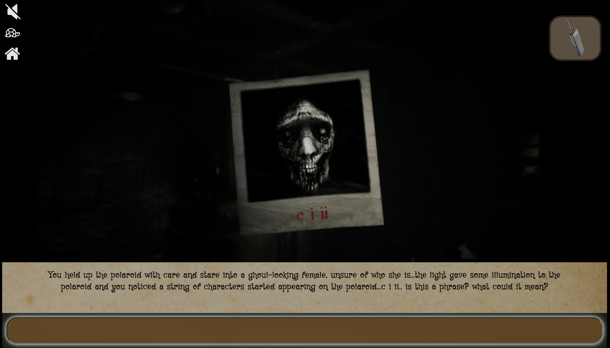

# MoMoWonderLand

MoMoWonderLand is a Choose Your Own Adventure game in which the player must avoid the urban legend MoMo and escape a prison.

You can start the game [here](https://shizhenggg.github.io/MomoWonderLand/)

For the best experience, please play the game in full screen and have the audio on (refresh the page if the audio is not playing)

## User Story

- At every stage of the game, the player must choose an option to proceed. The option chosen will lead them to different game paths which affect their chances of survival.
- Player will be able to collect items that they deem useful throughout the game
  
  
- Player will be able to use the items collected at certain stages
  
- Game controls are added for better gaming experiences
  • Turn on/off volume
  • Change the speed of typing animation (some people don't like to wait)
  • Homepage button to quit the game and return to homepage (In case it's too scary)
  
  
- Certain routes lead to game stage where players have to input the correct answers to progress in the game. This is to add more variation to the game to keep things more interactive instead of just pure clicking
  
  
  
- Certain options may lead to jumpscare (controlled by preset probability of 40% chance) which will immediately end the game.

## Tech Stack

- HTML
- CSS
- Javascript
- Jquery for DOM manipulation
- Jquery UI for shake animation
